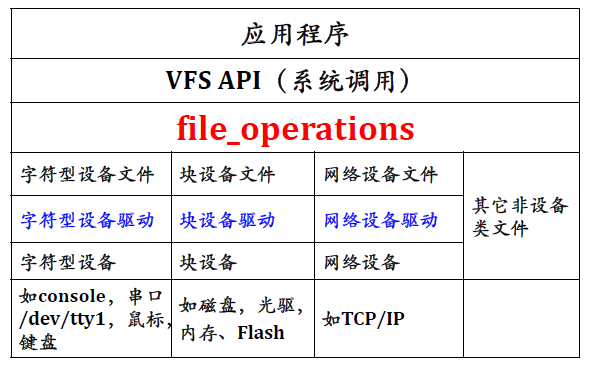
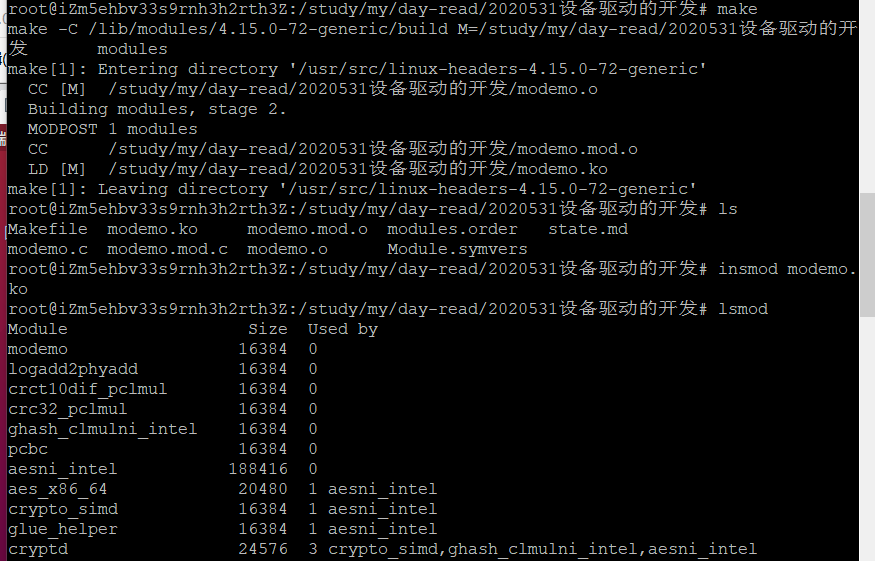

# 一、什么是设备驱动？

驱动程序是操作系统内核和硬件设备之间的接口。系统通过各种驱动程序操纵硬件设备，操作系统提供统一的操作方式与各种设备驱动对接，这是OS最基本的功能之一。

**OS kernel -> device driver -> device**

设备驱动通常采用模块的方式加载到内核。所以，进行驱动开发时，没有一般应用程序开发时的main()函数，而是采用模块函数模板。

虽然设备有各种类型，但总体来说, 设备驱动应包含下述基本的功能：
> 1. 设备初始化
> 2. 设备启动/停止
> 3. 设备控制与管理,如:
> > 1. 参数设定，如setup bitrate
> > 2. 错误检测与处理等
> 4. 内核与设备间的数据传送（读写操作）
> 5. 应用程序与设备间的数据传送（读写操作）


Linux device driver的主要特点：
> 1. device driver以设备文件的形式进行管理
> 2. 驱动程序运行在内核态，其代码（模块）一旦加载到内核，便成为内核的一部分.
> 3. 设备驱动可以在配置和编译内核时直接集成到内核中，所以有内核加载和模块加载之分




Linux为不同的（字符型、块）设备所对应的驱动程序提供统一的调用接口。

驱动程序使用的结构体
```c
struct file

struct file_operations

struct inode				// inode是Kernel用来管理文件的超大型数据结构
```

## 1.设备缓存
字符设备和块设备的I/O操作是有区别的：

1. **块设备**在每次硬件操作时把多个字节传送到主存缓存中或从主存缓存中把多个字节信息传送到设备中。
2. **字符设备**并不使用缓存，以逐个字节的方式信息传送。

字符设备和块设备在/dev目录下有文件与之对应。

## 2.设备文件
在linux中设备可以当作文件进行打开、读、写关闭操作。

设备文件放在/dev目录下，如/dev/console。

设备文件可以挂载到任何指定目录下，但设备驱动在使用前要先注册，使用完注销。
> register_chrdec()/register_blkdev()<br>
> unregister_chrdev()/unregister_blkdev()<br>

linux编写程序的关键步骤：（以scull为例）
1. 定义设备驱动程序接口(struct file_operations)
> 如scull_open(), scull_release(), scull_read(), scull_write(), scull_ioctl()等

2. 定义设备驱动程序初始化和注销函数
> 如scull_init_module(), scull_cleanup_module()

3. 编译驱动程序
> 放在内核源码树外，创建Makefile，编译驱动模块<br>
> 加入到内核源码树，更新Kbuild，创建Makefile，menuconfig，编译内核和驱动模块<br>

4. 创建设备文件
> mknod Device_name {b|c} major minor<br>
> mknod myscull c 240 0<br>

5. 加载/卸载驱动
> insmod myscull.ko
> rmmod myscull

6. 测试驱动程序
> 如test.c

Linux内核调试技术:

printk/strace/kernel oops messages/magic SysRq key/KDB/KGDB/gdb for kernel debug

# 二、设备驱动开发实例
使用一个[modemo.c](modemo.c)进行模块测试

## 1.模块放在内核源码树外进行插入
首先编写一个Makefile文件[Makefile](Makefile)

Makefile文件需要和modemo.c文件在同一目录下

执行以下命令



从上图中可以看出，使用lsmod命令后，modemo模块已经插入了内核

查看 **/var/log/kern.log**可以查看到模块的打印信息


```shell
insmod *.ko		# 插入模块
rmmod  *.ko 	# 删除模块
lsmod  			# 查看模块
tail -n 5 /var/log/kern.log		# 查看日志文件，可查看模块化中的打印消息
```
## 2.将模块加载到内核源码树
嵌入式软件开发技术与工具（11）

# 三、scull
scull的作用是把一块内存区域当成字符设备使用，即scull驱动的目标设备是一块内存区域。

scull不依赖于任何硬件，只是为了展示kernel与char driver之间的接口，不具有使用功能。

但考虑到许多设备是memory-mapped，就设备驱动的开发过程来说，scull设备和真实设备具有很好的相似性！

sbull(Simple Block Utility for Loading Localities)完成基于内存的ramdisk功能，有一定的用处。加载sbull后，可以在内存虚拟的disk上进行分区、创建、删除、读写文件等


